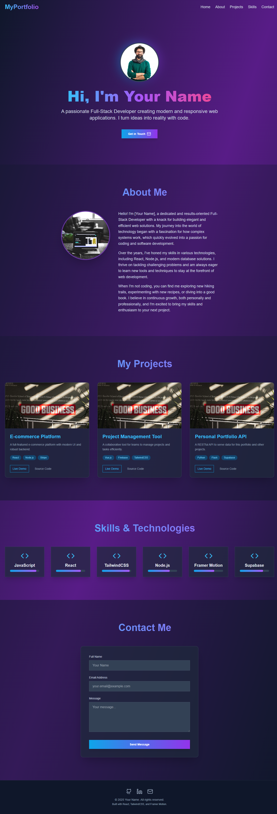

# 🎨 AI-Generated Portfolio Website

A modern, responsive, and visually appealing **React + Vite** portfolio template — perfect for developers, designers, and freelancers. Built with clean UI components, fast loading, and smooth transitions to showcase your skills in style.

---

## 🖼️ Live Preview

<p align="center">
  
</p>

> This screenshot shows the homepage layout of the portfolio website.

---

## 🚀 Features

- ⚛️ Built with **React** & **Vite** for blazing-fast performance
- 📱 Fully responsive: mobile, tablet, and desktop ready
- 🔥 Smooth animations and transitions


## 📦 Download the Source Code

Download the ZIP file:

[🔗 Click to Download ZIP](https://github.com/alsaeeddev/web-portfolio-template/archive/refs/heads/main.zip)

Or clone the repository:

```bash
git clone https://github.com/alsaeeddev/web-portfolio-template.git
